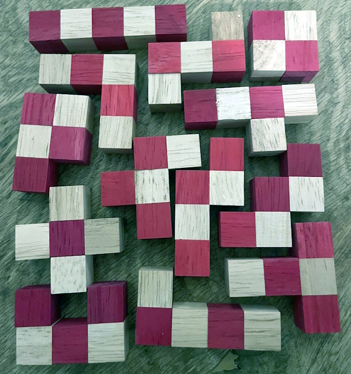

# woodenpuzzle

This is an Answer Set Programming (ASP) solution to a wooden puzzle as shown in the image above. ASP is a declartive programming language to model your problem and let a solver find solutions. We use [Clingo](https://potassco.org/clingo/) as our solver. 

# Run
To run a depth experiment, as described in our paper, you can run: `clingo.exe 0 -t4 basic.lp --const depth=2`

`0` means to find all solutions and `-t4` to utilize 4 threads.

# Structure

ASP
- `basic.lp` and `optimmized.lp` are two implementations in ASP.
- `13p-definitions.lp` and `13-orientations.lp` are two facts file , used by both implementations, regarding the pieces used in this puzzle. 
- `2p-definitions.lp` and `2p-orientations.lp` are two fact files for our running example of a 2x2 board with 2 pieces.

Python
- `experiment.py` and `process.py` are two Python scripts that executes our two implementations for different Clingo configuration, in different depths, multiple times and process the results. 

C#
- The `dotnet` folder contains an imperative programming solution written in `C#` 

R
- To analyse our runtime characteristics, we use a small R script to calculate $R^2$ statistics for different models.

